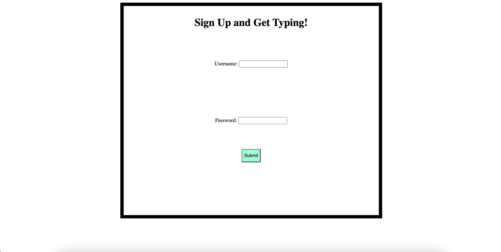
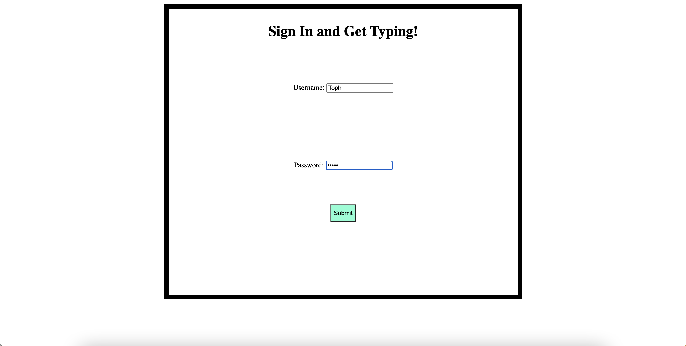
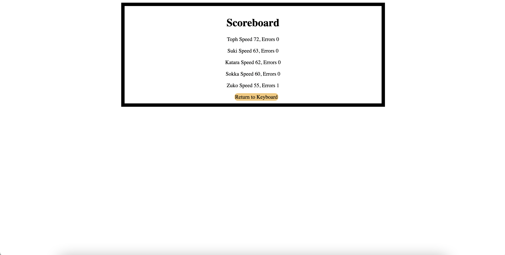

# Full Stack Typing Practice Web App

# Overview

This program helps the user improve their typing skills. It provides practice quotes and animates the typing process on a virtual keyboard. It displays user stats and records them in a database to track progress. It allows users to sign in and compete with each other. The backend employs password hashing, data encryption, and user authentication.

I wrote this software to demonstrate my understanding of API development, User Interface development, async programming, and how to connnect backend to frontend.

[Software Demo Video](https://us06web.zoom.us/rec/share/BWODzcFrHH9PqZtB4VEbRbeLuQzPKMSHHLl_s_jsE7-cz41UZ-M7xl4Bxhdu2UY.jHgDFf0zjY48s9Nx?startTime=1698194256000)

# Web Pages

The program is made up of four pages. Sign Up, Sign In, ScoreBoard, and Keyboard. Once a user signs up, they can sign in to view their personal stats and attempt to beat their record. They can also view the ScoreBoard which displays the scores of all users with the best performers at the top.

# Development Environment

The backend API and Server were written with Node.js, express, and Javascript. MySQL was used to record user data. The front end was built with Javascript, HTML, and CSS.

bcrypt was used for password hashing, JsonWebToken was used for user authentication, and Sequelize was used to connect the database. PostMan was used for testing the backend during development.

The randomly generated quotes were provided by an outsourced API called Quotable.

# Useful Websites

- [W3 Schools](https://www.w3schools.com/nodejs/)
- [Sequelize](https://sequelize.org/docs/v6/getting-started/)
- [Coder Awesome Youtube](https://www.youtube.com/watch?v=38L3E-Zrswo)

# Future Work

- Improve the CSS styling on all the pages
